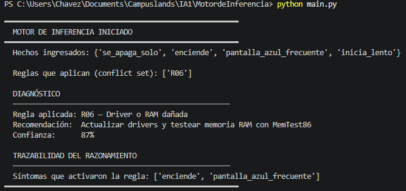
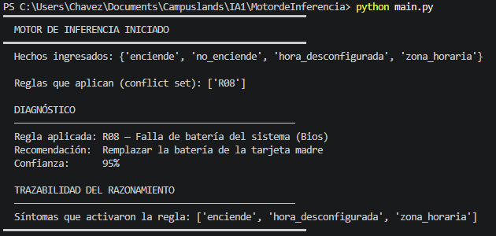
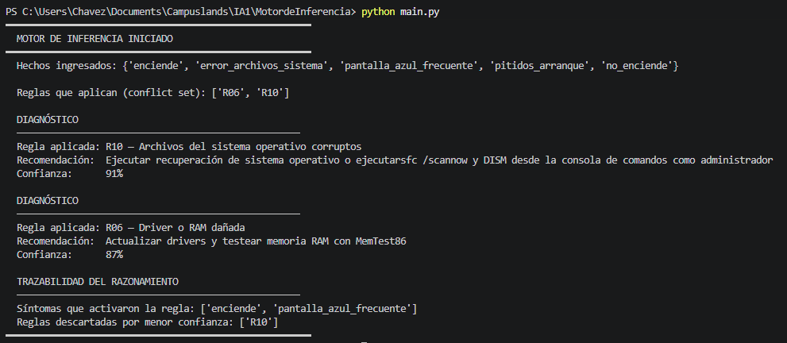

# Motor de Inferencia

## Explicación de motor de inferencia


Función: `consultar()`

La función de consultar realiza la iteración de la lista de preguntas y las muestra en terminal para capturar la respuesta en la lista de base de hechos.
Finaliza haciendo el llamado de la función de inferir. 

Función: `inferir(base_conocimiento, hechos)`

La función de inferir, muestra el resumen de los sintomas (hechos) obtenidos de las preguntas, hace un llamado de la funcion "equiparar" devolviendo el ID del diagnostico posible, y realiza la impresion a terminal. 

Función: `equiparar(base_conocimiento, hechos)`

La función equiparar, realiza la validación de las condiciones de la base de hechos, y retorna el id de la donde los sintomas concuerden.

Función: `resolver_conflictos(conflict_set)`

La funcion valida el grado de confianza de cada regla para mostrar la que este mas acorde.



## Justificación de desafios implementados

**Nivel 1**

Reglas añadidas a la base de conocimiento:
```python
    {
        "id": "R08",
        "descripcion": "Falla de batería del sistema (Bios)",
        "condiciones": ["enciende", "hora_desconfigurada", "zona_horaria"],
        "conclusion": "Remplazar la batería de la tarjeta madre",
        "confianza": 0.95
    },
    {
        "id": "R09",
        "descripcion": "Problemas de red o interfaz Wi-Fi",
        "condiciones": ["enciende", "sin_conexion_internet", "icono_red_deshabilitado"],
        "conclusion": "Reinstalar controlador de red o reemplazar tarjeta Wi-Fi/Ethernet",
        "confianza": 0.85
    },
    {
        "id": "R10",
        "descripcion": "Archivos del sistema operativo corruptos",
        "condiciones": ["enciende", "pantalla_azul_frecuente", "error_archivos_sistema"],
        "conclusion": "Ejecutar recuperación de sistema operativo o ejecutarsfc /scannow y DISM desde la consola de comandos como administrador",
        "confianza": 0.91
    },
```

Se añaden las reglas siguiendo la sintaxis de los sintomas originales, adicional se incluyen las preguntas adicionales para completar el cumplimiento de las reglas mostradas.

Preguntas añadidas:
```python
    "hora_desconfigurada":      "¿La fecha y hora se desconfiguran al apagar el equipo?",
    "zona_horaria":             "¿La zona horaria está configurada correctamente?",
    "sin_conexion_internet":    "¿El equipo no detecta redes ni permite conectarse a internet?",
    "icono_red_deshabilitado":  "¿El icono de red aparece con una 'X' roja o desactivado?",
    "error_archivos_sistema":   "¿Aparecen mensajes de error indicando que faltan archivos del sistema?",
```

En base a las reglas añadidas se realizan las pruebas manuales para evaluar el correcto funcionamiento de las mismas



___

**Nivel 2**

```python
    #if not conflict_set:
    #    return None
    #return max(
    return sorted(
        conflict_set,
        key=lambda r: (r['confianza'], len(r['condiciones'])),
        reverse=True
    )
```
Se cambia el codigo de la funcion para validacion de resolver conflictos para que muestre todas las posibles en orden de confianza.
Adicional se realiza un bucle en la funcion en inferir para imprimir en terminal cada una de las reglas en cumplimiento.


___

<!-- Lista ordenada -->
1. ¿Cuál es la diferencia principal entre un sistema experto y un programa de software tradicional?

*Como software tradicional sigue un flujo en cascada tradicional a diferencia del sistema experto el cual separa la logica de la ejecucion en este caso las reglas, preguntas simulando el razonamiento con el motor de inferencia*

2. ¿Por qué se dice que los sistemas expertos tienen conocimiento separado de su motor de razonamiento? ¿Cuál es la ventaja de esto?

*Porque la base de conocimiento esta separada del codigo de motor de inferencia dando la ventaja que sea mas practico el mantenimiento (añadir, modificar o eliminar) la base de conocimiento sin afectar el motor.*

3. ¿Qué es la base de hechos y en qué se diferencia de la base de conocimiento?

*La base de hechos es la lista de las respuestas afirmativas obtenidas, la diferencia es que los hechos son los "sintomas" en este caso y la base de conocimiento son los "diagnosticos o problemas" conocidos.*

4. ¿Qué significa que un sistema experto pueda "explicar su razonamiento"? ¿Por qué esto es importante en medicina o derecho?

*Que se puede mostrar el paso a paso del proceso realizado para llegar a la conclusión, extrapolandolo a medicina o derecho son profesiones metodicas las cuales deben de poderse evidenciar los pasos realizados que validen sus diagnosticos o respaldo legal*

5. ¿Por qué fracasaron comercialmente los sistemas expertos en los años 90? Menciona al menos 3 razones.

*Se necesitaban ingenieros con un conocimiento que resultaba muy costoso de mantener, la capacidad de adaptacion de los nuevos datos y era muy sensible con los cambios leves de información dando fallos*

6. Dada la siguiente regla: SI (fiebre AND tos) OR perdida_olfato ENTONCES sospecha_covid y los hechos: {fiebre=True, tos=False, perdida_olfato=True} — ¿Se activa la regla? ¿Por qué?

*Si porque aunque la validación de fiebre y tos no se cumple la de perdida de olfato es true y al tener "o" en la validación hace que cumpla la regla*

7. Completa la tabla de verdad para la expresión (A AND NOT B) OR (NOT A AND B) para todos los valores posibles de A y B.

| A | B | Not A | Not B  |
| --- | --- | --- | --- |
| false | false | true | true |
| false | true | true | false |
| true | false | false | true |
| true | true | false | false |

8. ¿Cuál es la diferencia entre encadenamiento hacia adelante y hacia atrás? Da un ejemplo de una situación real donde usarías cada uno.

*Hacia delante se desarrolla de los hechos conocidos hacia la conclusión, y hacia atras desde la meta buscando los hechos que lo respaldan.
En base a este taller, se ingresan los sintomas para descubrir el diagnostico, ejemplo de hacia delatente.
Un ejemplo de hacia atras seria la aprobacion de un credito bancario, se requiere aprobar un cliente y se cumple al evaluar las diferentes validaciones que debe cumplir.*

9. Diseña 3 reglas IF-THEN para un sistema experto que asesore a estudiantes sobre qué lenguaje de programación aprender primero, basándose en su objetivo (desarrollo web, análisis de datos, desarrollo de videojuegos).

*if objetivo = "desarrollo_web" then recomendacion = "JavaScript"
if objetivo = "analisis_datos then recomendacion= "Python"
if objetivo = "desarrollo_videojuegos then recomendar = "C#"*

10. Dibuja la red de inferencia correspondiente a las 3 reglas que diseñaste en la pregunta anterior.

|Objetivo | Regla | Recomendación |
| --- | --- | --- |
| desarrollo_web | R01 | JavaScript |
| analisis_datos | R02 | Python |
| desarrollo_videojuegos | R03 | C# |

11. ¿Qué problema de diseño podría surgir si dos reglas tienen exactamente las mismas condiciones pero conclusiones diferentes? ¿Cómo lo resolverías?

*Se deberian de añadir mas condiciones a una o ambas reglas para que sea mas especifica la desición.*